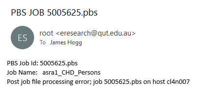

```{r setup, include=FALSE}
knitr::opts_chunk$set(echo = TRUE)
library(tinytex)
```

This document stands as a stripped back manual for successfully operating the Queensland University of Technologies (QUT) High Performance Computing (HPC) system for staff at the DOHWA. This manual is relatively specific to the Bayesian modelling project. For a more general manual we strongly recommend the HPC guide written by Ethan Goan (a current QUT PhD student). His guide is available in the `resources\Other_resources` folder in this repository. 

The QUT HPC facilities provide access to a large amount of high quality computational resources (listed below). These resources are allocated to users in a job-by-job basis. You'll learn how this works in this manual. 

- 212 compute nodes
- 3780 Intel Xeon Cores
- Approx. 200G B RAM per Compute Nodes
- 34 TB of main storage
- 1800 TB additional storage in file store
- 24 Tesla GPUs
- Visualisations services and more

Before beginning I should highlight some limitations of this manual and my skillset in operating and diagnosing HPC problems. I am not programmer or computer scientist. Most of my knowledge of the HPC is highly specific to my use cases. For this reason, I often refer to stack Overflow and (more recently) ChatGTP for help. As your HPC processes become more specialised and complicated, you will see the benefits in using these resources. 

# Logging in for the first time 

Open Command Prompt (from your computers search bar) and type

```{bash, eval=FALSE}
ssh <your_qut_id>@Lyra.qut.edu.au
```

where you will replace `<your_qut_id>` with your personal QUT ID. Then hit ENTER. The console will then prompt you to enter your password. 
**IMPORTANT**: *While typing your password, the console will not show you any dots. It will appear as if the console is not recognizing that you're inputting your password. Be assured that it is.* 

Once you've typed you password and hit ENTER you will now be inside the Lyra head node. Your screen might look something like the one below. 

```{bash, eval=FALSE}
C:\Users\n9401849>ssh n9401849@Lyra.qut.edu.au
* ============================================================================ +
* Access to this computer system is only for authorised QUT staff and students *
* and external persons authorised by QUT.                                      *
* ---------------------------------------------------------------------------- *
* WARNING:        It is a criminal offence to:                                 *
*                 i.  Obtain access to data without authority.                 *
*                 ii. Damage, delete, alter or insert data without authority.  *
* ---------------------------------------------------------------------------- *
* Communications on or through QUT's computer systems are monitored and        *
* recorded to secure effective system operation and for other lawful purposes. *
+ ============================================================================ +

+ --------- Please login using your QUT Access Username and Password --------- +

n9401849@Lyra.qut.edu.au's password:
Last login: Tue Aug 15 04:44:18 2023 from 172.26.218.129


                                                 ___    _   _   _____
                                                / _ \  | | | | |_   _|
                  *                            | | | | | | | |   | |
                 *  *                          | |_| | | |_| |   | |
                  *                             \__\_\  \___/    |_|
                 *  *
                 * *                              WINTER HPC IMAGE
                  * *
                   *                                  ^
            ___.___^_____...__-----.---..._          / \
 ~~~~~~~~~~/~~~~~~~~~~~~~~~~~~~~~~~~~~~~~~~`-._..__.;~~~}~~~~~~~~~~~~~~~~~~~~~~
          /            °                               ≺
  °      (------ 0        .     *        °   _--.-.-,   }      *
          \             °     .    .__.___;-‾        \ /               °
           \_____\  \___.__.____._/                   V
               \  \  \                                     ___
     °          \__\  \            *                      (___)
                    \__\                      °            S S            *
                                   <=><                    S S       °
         *                     °

Available walltime until next scheduled maintenance window: 531:4:59
n9401849@Lyra01:~>
```

The Lyra head node is what I call the "entrance" to the HPC. Think of it like the lobby of a hotel: you don't spend much time there or do anything considerable (like running a model!), but you have to go through it each time you wish to enter or leave your room. Furthermore if you'd like to change your room or make a request (submit a job to the HPC) you have to go to the lobby to do so (at least before we had phones!). 

Note that the leading `n9401849@Lyra01:~>` is often called the *shell prompt*. It typically displays information about the current user and the host name of the machine. This is where you will type all your code.

## Some basic Unix code

The QUT HPC runs on a programming language called Bash or Unix. The two languages are similar but not identical. That said, the distinction is not important here. Let's explore some simple Unix code to get started.  

When you first enter the HPC system, Lyra will automatically place you in your home directory. To see what files are there you can (1) explore the mounted drive on your computer or (2) type 

```{bash, eval = FALSE}
ls
``` 

directly in the console.

If you'd like to explore a folder you can type `cd <myfolder>` where you can replace `<myfolder>` with the name of the folder you'd like to explore. To return to the outer folder just type `cd ..`. **NOTE**: *Spaces matter a great deal in Unix so please be careful when typing in the commands.*

You can even access R directly in the head node. Just enter the following lines, clicking ENTER for each new line.

```{bash, eval = FALSE}
module load r/4.0.3-foss-2020b
R
``` 

You should see the normal R information printed to your console. To return to the head node, just type `q()`. **NOTE**: *It is generally ill-advised to access software directly in the head node as it can make everyones HPC experience slower (don't be that person!). The head node is not a powerful computer and should only be used to submit jobs!*

You'll notice that we ran a strange command starting with `module load `. Modules are pieces of software that are available from the QUT HPC - there are absolutely loads! If all were loaded every time we opened Lyra, we would be waiting for a *long* time. Instead, we have to tell Lyra what modules we'd like to use. In the case above I told the QUT HPC that I would like to use R version 4.0.3. At the time of writing, this is the most recent version of R available to HPC users.  

# Your first HPC job - installing R packages

As you might expect loading the R module only loads base R packages. To install packages we'll need to exit the Lyra head node and enter a hotel room (aka, a HPC job). 

The way *most* HPCs work is that users submit a request asking for specific computational resources for a specific time period. Then users wait for the HPC (or more specifically the Portable Batch System (PBS)) to find and allocate the required computational resources. Depending on your specifications you could be waiting seconds or days for the computational resources to become available. **Remember**: *You and other researchers are sharing the HPC so try to never request more resources than you need. This common courtesy ensures that you don't have to wait hours for a small HPC job.* 

To request for a HPC job, we use the `qsub` command, which I *think* means to submit a computational query. The example code below shows how to ask for 1 hour (`walltime`), 1 CPU (`ncpus`) and 2 GB of RAM (`mem`). 

```{bash, eval = FALSE}
qsub -I -S /bin/bash -l walltime=1:00:00,ncpus=1,mem=2gb
```

You can of course edit this to match your needs. For example, 

```{bash, eval = FALSE}
qsub -I -S /bin/bash -l walltime=0:20:00,ncpus=1,mem=2gb
```

only asks for 20 minutes of computational resources. 

Once you type the code above, you should see a printout similar to

```{bash, eval = FALSE}
n9401849@Lyra01:~> qsub -I -S /bin/bash -l walltime=1:00:00,ncpus=1,mem=2gb
qsub: waiting for job 5030193.pbs to start
qsub: job 5030193.pbs ready

n9401849@cl4n007:~>
```

This indicates that you are now inside a "node" of the HPC that will automatically exit (aka shutdown) after 1 hour. Notice how the prefix to the `~>` has changed from `n9401849@Lyra01:` (the head node) to `n9401849@cl4n007:` (the job). Now returning to the task at hand, we'd like to run some R code. Using what we just learned we load the R module and open R. 

As you might expect the permissions on the HPC are strict and confusing. You **CANNOT** install R packages into the root directory. If you try, R will send a series of errors your way. Instead, we create a new folder in our personal directory to hold our R packages.  I've called my folder `r_lib`. You can create your folder in the usual way (via the mounted drive on your local computer), by running

```{r, eval = FALSE}
dir.create("r_lib")
```

in R or 

```{r, eval = FALSE}
mkdir r_lib
```

in Unix. You choose! 

Next, we need to tell R to install and search for packages in your newly created folder. This is achieved by running 

```{r}
.libPaths("r_lib")
```

at the start of *all* R sessions on the HPC. Repeating for emphasis - the `.libPaths("r_lib")` command must be used at the beginning of every R session. Without this command, R won't find any of your packages and your HPC job will most likely fail miserably! Now that we have told R where to install your packages, the process is as simple as running `install.packages("<package_name>")`.  

When you are finished installing your packages type `q()` to exit R and then `logout` to end the HPC job. At this stage you'll be returned to the Lyra head node. 

Congratulations, you've just successfully submitted an interactive HPC job to use R.

# HPC jobs

There are two main types of jobs you can submit to the HPC; interactive and batch jobs. Interactive jobs provide you with an interactive R session like what we just saw. **NOTE:** *You will need to have your interactive session open for the job to continue.* [Batch jobs](#batch) are intended for jobs that will need to run for longer, or when multiple jobs need to be submitted simultaneously. Unlike interactive jobs, after you submit a batch job, you can close your connection to HPC altogether (and even shut your local computer down!) without affecting the jobs processing on the HPC.

## Submitting an R script

We've already learned how to submit interactive jobs, but these can be a little cumbersome, as we need to manually type all our commands into R. What if we had an R script that we'd like to run on the HPC. Of course, first we need to load all the R scripts and data into your personal HPC directory; I do this via the mounted drive on my local computer. **NOTE**: *The HPC cannot access data that is not in your HPC personal directory.*

To submit an R script to run on the HPC, we must write a corresponding `.sub` script which specifies the computational resources we need and what we'd like to run. These files, written in Unix code, have many names, but in this manual you can think of them as configuration files. Below is an example. 

```{bash, eval = FALSE, attr.source='.numberLines'}
#!/bin/bash -l					// The Shebang - don't ask me why!
#PBS -N myfile 				    // NAME of job on Lyra
#PBS -l ncpus=1 			    // number of cores
#PBS -l mem=2GB 			    // memory allocation for job
#PBS -l walltime=1:00:00	    // time allocation for job
#PBS -e myjob_errors            // where to save the error file
#PBS -o myjob_output            // where to save the output file 
```

**NOTE:** *Do not include the backslashes and comments, these cause headaches for Unix. I have included them for instructional purposes only.*

When the HPC reads the above `.sub` file, it will know that we are requesting a HPC job called `myfile` which requires 1 CPU, 2 GB of RAM and 1 hours of run time. I discuss choosing memory and walltime values and lines 6-7 [here](#mem) and [here](#out). Although the above `.sub` file is technically complete, it doesn't have any commands yet. To run an R script using a `.sub` script we can add the following code. 

```{bash, eval = FALSE, attr.source='.numberLines'}
module load r/4.0.3-foss-2020b
module load gdal/3.2.1-foss-2020b
R -e "source('QUTHPC_training/single/ms.R')"
```

The example above is extremely simple. On lines 1 and 2 we load the R module and the `gdal` module, which is required when handling spatial data in R. On the 3rd line we tell Unix to open R and then run what ever code is inside the quotation marks. Technically you could write *all* your R code here, however I strongly recommend against this.

Instead, we tell R to run the entire `ms.R` script. Now that we have successfully written a `.sub` file, we can use it to create a HPC job. 

```{bash, eval = FALSE}
n9401849@Lyra01:~> qsub myfile.sub
5059221.pbs
```

By running `qsub <sub_file>`, we tell the PBS system to read the file for (1) the computational resources we required and (2) the code we wish to run. When running a single `.sub` file, the PBS will acknowledge your request for a job by printing a unique Job ID. In the example above this is `5059221.pbs`. If you do not see a Job ID, then there is something wrong with your `.sub` file.    

## Monitoring the status of jobs

To monitor the status of your submitted jobs run the following command. Remember spaces are important in Unix.  

```{bash eval = FALSE}
qstat -u <your_qut_id>
```

Of course in practice you will replace `<your_qut_id>` with your QUT id number. This command will provide an output structured like this. 

```{bash eval = FALSE}
n9401849@Lyra01:~> qstat -u n9401849

pbs:
                                                                 Req'd  Req'd   Elap
Job ID               Username Queue    Jobname    SessID NDS TSK Memory Time  S Time
-------------------- -------- -------- ---------- ------ --- --- ------ ----- - -----
5005627.pbs          n9401849 quick    asra1_Ast*    --    1   1    2gb 01:00 Q   --
5005628.pbs          n9401849 quick    asra1_CHD*    --    1   1    2gb 01:00 Q   --
```

To understand this output I'll describe each column in turn. Some of these you may be able to guess anyway!

- `Job ID`: The unique job ID provided by the PBS. 
- `Username`: Your QUT username that you used to log into the HPC system. 
- `Queue`: Based on the computational resources you requested, the PBS categorizes the job using simple descriptive language. For the example above, where we only requested 1 hour of Walltime, the PBS has assigned this job `quick`. Other options include `long`.  
- `Jobname`: The assigned job name that we fed to the HPC via the second line of the `.sub` file. 
- `SessID`: NA
- `NDS`: Number of cores requested
- `TSK`: NA
- `Req'd Memory`: memory allocation for job
- `Req'd Time`: time allocation for job
- `S`: Status of the job. Options include `Q` (queued), `R` (running) and `E` (elapsed). 
- `Elap Time`: Elapsed time for the job. Only shows a value once `S` = `R`. Once `Elap Time` is equal to `Req'd Time` the job stops --- regardless of if it has finished or not! For this reason it is always best to slightly overestimate the run time of your jobs.

If some of these values don't look right, stop the job and edit your configuration file accordingly before resubmitting. To stop a queued job, run

```{bash, eval = FALSE}
qdel <jobid> // include the .pbs at the end
``` 

When your models are running the `qstat` call will look like this.  

```{bash eval=FALSE}
n9401849@Lyra01:~> qstat -u n9401849

pbs:
                                                                 Req'd  Req'd   Elap
Job ID               Username Queue    Jobname    SessID NDS TSK Memory Time  S Time
-------------------- -------- -------- ---------- ------ --- --- ------ ----- - -----
5005629.pbs          n9401849 quick    asra1_Ast*  47118   1   1    2gb 01:00 R 00:01
5005630.pbs          n9401849 quick    asra1_CHD*  47168   1   1    2gb 01:00 R 00:01
```

In practice, most of the time your use of the HPC head node will be to monitor your jobs, so ensure you're accustomed to the `qstat` command. 

## Choosing `walltime` and `mem` {#mem}

There is a real art in setting memory and walltime values when running jobs on the HPC.

Walltime is the total amount of time it will take to complete your job. This includes loading packages, data, compiling, fitting and summarising the model, and saving any output. You must leave sufficient time for all these tasks to be complete as the HPC will stop the job once the `walltime` has been met. Like most of our scripts, the last commands are always to save our results. To avoid running models for days and then having the results discarded it is best practice to save model results earlier in your scripts if possible. If you wish to save space, you can always tell R at the very end of your script to delete a file. 

To help guess how long a model will take, I recommend making use of the `jf$MCMCrecommendations` function which allows one to approximate the run time of a model based on a shorter run of the same model. Of course, this function is an approximation to the run time of the model *only*, it cannot indicate how long model saving or summarising will take. 

Setting the memory value is argueable more difficult. Unlike your local R session which will just run slower if it exceeds your memory, the HPC will just end your job --- loosing any modelling done up to that point. To avoid this, it is best practice to run your models with a high value of memory (say 10GB) to start with and then reduce this as necessary. 

You might think that just setting memory very high is the pragmatic solution. **Please don't do this!** Firstly, by asking for computational resources you don't need, you slow the HPC down for everyone. Secondly, by requesting large amounts of RAM (memory) will make it take substantially longer for the PBS to allocate you a job. For example, if you request 100GB, you might have to wait an hour for the PBS to allocate you this job.

In R you can assess the size of your objects (say your `draws` or `fit` objects) using `format(object.size(<object_name>), units = "Mb")`. Remember that R holds all objects in memory. Thus, by summing the size of all the ("large") objects that you'll need to have simultaneously available in R, you can glean an initial approximation to the memory value you should specify in your configuration `.sub` file. 

I find that an iterative process for deciding walltime and memory is most efficient. First, set a reasonably large value for both. After a successful HPC job is complete, the output and error files (see [below](#out)) provide detailed information about the computational resources the HPC *actually* used, irrespective of what you requested. By viewing these values, you can find an optimal upper bound for both values.  

## The output file {#out}

Here is an example of the corresponding output file that Lyra creates when a job has ended. In (almost!) all cases, Lyra will create an output and error file regardless of whether the job was successful. Note that when I refer to success I mean the R script finished running and the required files were successfully saved.  

```{bash eval=FALSE, attr.source='.numberLines'}
R version 4.0.3 (2020-10-10) -- "Bunny-Wunnies Freak Out"
Copyright (C) 2020 The R Foundation for Statistical Computing
Platform: x86_64-pc-linux-gnu (64-bit)

R is free software and comes with ABSOLUTELY NO WARRANTY.
You are welcome to redistribute it under certain conditions.
Type 'license()' or 'licence()' for distribution details.

  Natural language support but running in an English locale

R is a collaborative project with many contributors.
Type 'contributors()' for more information and
'citation()' on how to cite R or R packages in publications.

Type 'demo()' for some demos, 'help()' for on-line help, or
'help.start()' for an HTML browser interface to help.
Type 'q()' to quit R.

> .libPaths('r_lib');
> base_folder='QUTHPC_training';
> model_spec='asra1';
> sex='Female';
> condition='Asthma';
> Rfile='asra1_Asthma_Female';
> cur_date='20230815';
> niter=800;
> nburnin=400;
> thin=1;
> nchains=4;
> source('QUTHPC_training/ms.R');
|-------------|-------------|-------------|-------------|
|-------------------------------------------------------|
|-------------|-------------|-------------|-------------|
|-------------------------------------------------------|
|-------------|-------------|-------------|-------------|
|-------------------------------------------------------|
|-------------|-------------|-------------|-------------|
|-------------------------------------------------------|
> 
> 
PBS Job 5005634.pbs
CPU time  : 00:04:10
Wall time : 00:05:50
Mem usage : 2097152kb
```

The output file is very useful in determining the computational resources that were *actually* used by the HPC during the running of the job. These details are available from line 41 onward. Note that CPU time and walltime are unique metrics. We're only interested in the walltime as this is what we set in the configuration file. 

In the example above, the HPC job ended after 5 mins and 50 seconds and used 2.097152 Gb of memory. Using the iterative method proposed above, we might consider setting the memory at 3GB and the walltime at 10 minutes. 

## The error file

Here is an example of the error file produced after a successful HPC job. We ran a simple `nimble` model. 

```{bash eval=FALSE}
── Attaching packages ─────────────────────────────────────── tidyverse 1.3.1 ──
✔ ggplot2 3.3.5     ✔ purrr   0.3.4
✔ tibble  3.1.5     ✔ dplyr   1.0.7
✔ tidyr   1.1.4     ✔ stringr 1.4.0
✔ readr   2.1.1     ✔ forcats 0.5.1
── Conflicts ────────────────────────────────────────── tidyverse_conflicts() ──
✖ dplyr::filter() masks stats::filter()
✖ dplyr::lag()    masks stats::lag()
Linking to GEOS 3.9.1, GDAL 3.2.1, PROJ 7.2.1
Loading required package: sp
Loading required package: spData
To access larger datasets in this package, install the spDataLarge
package with: `install.packages('spDataLarge',
repos='https://nowosad.github.io/drat/', type='source')`
nimble version 0.12.2 is loaded.
For more information on NIMBLE and a User Manual,
please visit https://R-nimble.org.

Attaching package: ‘nimble’

The following object is masked from ‘package:stats’:

    simulate


Attaching package: ‘Matrix’

The following objects are masked from ‘package:tidyr’:

    expand, pack, unpack

This is bayesplot version 1.8.1
- Online documentation and vignettes at mc-stan.org/bayesplot
- bayesplot theme set to bayesplot::theme_default()
   * Does _not_ affect other ggplot2 plots
   * See ?bayesplot_theme_set for details on theme setting
Defining model
Building model
Setting data and initial values
Running calculate on model
  [Note] Any error reports that follow may simply reflect missing values in model variables.
Checking model sizes and dimensions
  [Note] All model variables are initialized.
Compiling
  [Note] This may take a minute.
  [Note] Use 'showCompilerOutput = TRUE' to see C++ compilation details.
Compiling
  [Note] This may take a minute.
  [Note] Use 'showCompilerOutput = TRUE' to see C++ compilation details.
Starting sampling for 400 iterations for each of 4 chains.
Running chain 1 ...
Running chain 2 ...
Running chain 3 ...
Running chain 4 ...
Sampling took 0.92 mins
Median Rhat: 1 
0.01% of Rhats larger than 1.01 
Max Rhat = 1.01 (sigma) 
0.01% of ess_bulk are too small 
Min ess_bulk = 311.19 (sigma) 
0.01% of ess_tail are too small 
Min ess_tail = 285.74 (sigma) 
Average posterior draws per minute: 
Progress ... -> Point estimates...
Progress ... -> Standard errors...
Progress ... -> Highest density intervals...
Progress ... -> Point estimates...
Progress ... -> Standard errors...
Progress ... -> Highest density intervals...
```

Unlike the output file, the error file is useful for diagnosing errors produced by R during the HPC job. This is because the output file provides some of the output from `R` like you would see in `RStudio` on your local machine. 

Below is an example error file for when a job is stopped early due to an `R` error. 

```{bash eval=FALSE}
── Attaching packages ─────────────────────────────────────── tidyverse 1.3.1 ──
✔ ggplot2 3.3.5     ✔ purrr   0.3.4
✔ tibble  3.1.5     ✔ dplyr   1.0.7
✔ tidyr   1.1.4     ✔ stringr 1.4.0
✔ readr   2.1.1     ✔ forcats 0.5.1
── Conflicts ────────────────────────────────────────── tidyverse_conflicts() ──
✖ dplyr::filter() masks stats::filter()
✖ dplyr::lag()    masks stats::lag()
Linking to GEOS 3.9.1, GDAL 3.2.1, PROJ 7.2.1
Loading required package: sp
Loading required package: spData
To access larger datasets in this package, install the spDataLarge
package with: `install.packages('spDataLarge',
repos='https://nowosad.github.io/drat/', type='source')`
nimble version 0.12.2 is loaded.
For more information on NIMBLE and a User Manual,
please visit https://R-nimble.org.

Attaching package: ‘nimble’

The following object is masked from ‘package:stats’:

    simulate


Attaching package: ‘Matrix’

The following objects are masked from ‘package:tidyr’:

    expand, pack, unpack

This is bayesplot version 1.8.1
- Online documentation and vignettes at mc-stan.org/bayesplot
- bayesplot theme set to bayesplot::theme_default()
   * Does _not_ affect other ggplot2 plots
   * See ?bayesplot_theme_set for details on theme setting
Error in file(filename, "r", encoding = encoding) : 
  cannot open the connection
Calls: source -> withVisible -> eval -> eval -> source -> file
In addition: Warning message:
In file(filename, "r", encoding = encoding) :
  cannot open file 'QUTHPC_training/r_src/asra2.R': No such file or directory
Execution halted
```

As you can see, the job was stopped early due to a directory issue. 

## HPC errors

Hopefully you now understand the power of the error and output files produced by Lyra. Fortunately Lyra also produces helpful output when jobs are stopped due to exceeded computational resources. If your memory allocation is exceeded, you might observe the following line in the error file.

```{bash, eval = FALSE}
/var/spool/PBS/mom_priv/jobs/5059208.pbs.SC: line 23: 47174 Killed
```

While in the output file you might see

```{bash, eval = FALSE}
Mem usage : 2097152kb
```

which has clearly exceeded the memory of 2GB we set. Remember there are 1 million kB in a GB. 


If you job has continued to run past its allocated walltime, the PBS will automatically stop the job. In this case, the error file might say 

```{bash, eval = FALSE}
=>> PBS: job killed: walltime 77 exceeded limit 60
```

While in the output file you'll see 

```{bash, eval = FALSE}
CPU time  : 00:00:59
Wall time : 00:01:28
Mem usage : 1029864kb
```

which clearly shows that we've exceeded the 1 minute of resources we requested. 

Sometimes an error will occur that is unique and potentially one that cannot be described in the standard error and output files. In these instances you will receive an automated email from the HPC system that may look like this.



If this happens please contact me. In most cases, this is a result of an error in the HPC system. However in some cases, if your specification of output and error files (in terms of where they will be saved) is incorrect, the PBS emails you instead. 

# Batch running of jobs {#batch}

So far we've described running a single R script (or a single job) on the QUT HPC. In this section, we'll descibe how Unix code can be used to create *and* run multiple jobs simultaneously. For example, we might wish to run all combinations of the models, sexes and conditions. Using Unix code, we can achieve this with a single command line call. 

First though, we must define a new file type, called a `.sh` file, thats purpose is to create and submit `.sub` files to the PBS. Below is a complex example of a `.sh` file, which I will guide you through. 

```{bash, eval = FALSE, attr.source='.numberLines'}
#!/bin/bash

base_folder='QUTHPC_training/batch'

# Model
for model_spec in asra1 asra2 ## Name of file that runs the model
do
	
	# Sex
	for sex in Persons Female Male
	do
	
		# Condition
		for condition in Asthma CHD
		do
	
			# create the unique file name
			Rfile=$model_spec'_'$condition'_'$sex
	
			# get the current date
			cur_date=$(date +%Y%m%d)
		
			# create directories
			mkdir -p $base_folder/sub_src/$cur_date
			mkdir -p $base_folder/outputs/Lyra
			mkdir -p $base_folder/outputs/Lyra/$cur_date/errors
			mkdir -p $base_folder/outputs/Lyra/$cur_date/out
			mkdir -p $base_folder/outputs/$condition
			mkdir -p $base_folder/outputs/$condition/$sex
			
			# Set loop output file with full directory
			loop_output_file=$base_folder'/outputs/'$condition'/'$sex'/'$Rfile

			# create the unique .sub script files
			file=$Rfile'.sub'

			# paste the commands in the .sub scripts
			cat > $base_folder/sub_src/$cur_date/$file <<EOF
#!/bin/bash -l
#PBS -N $Rfile
#PBS -l ncpus=1
#PBS -l mem=2GB
#PBS -l walltime=0:20:00
#PBS -e $base_folder/outputs/Lyra/$cur_date/Lyra_errors/$Rfile
#PBS -o $base_folder/outputs/Lyra/$cur_date/Lyra_out/$Rfile

module load r/4.0.3-foss-2020b
module load gdal/3.2.1-foss-2020b

R -e ".libPaths('r_lib');
base_folder='$base_folder';
loop_output_file='$loop_output_file';
model_spec='$model_spec';
sex='$sex';
condition='$condition';
cur_date='$cur_date';
niter=800;
nburnin=400;
thin=1;
nchains=4;
source('$base_folder/ms.R');"
EOF

			# run each script
			qsub $base_folder/sub_src/$cur_date/$file

		done
	done
done
```

To define every unique combination of models, sexes and conditions, we define three nested 'for-loops'. These are visible in lines 6-7, 10-11 and 14-15. The loops are closed on lines 67-68. Just like in R, the 'for-loop' syntax in Unix defines creates a dynamic variable which takes on a new value for each round. Consider the 'for-loop' defined on line 6. Here, the variable `model_spec` takes on the value `asra1` for the first round and then `asra2` for the second. To reference a dynamic variable in Unix, we use `$model_spec`. 

After defining the 'for-loops', we create a unique file name, called `Rfile`, on line 18. This is created by joining the dynamic variables defined in the 'for-loops'. For the first loop `Rfile` will equal

```{bash, eval = FALSE}
asra1_Asthma_Persons
```

Line 21 gives the current date. This is useful to document our error and output files from Lyra. Following this, from lines 24 to 29 we create a variety of directories (using the `mkdir -p` command) into which our `.sub` files and results will be saved.  

Then in lines 32 and 35, we create additional dynamic variables that will be used later. For the first loop `loop_output_file` will be equal to

```{bash, eval = FALSE}
QUTHPC_training/batch/outputs/Asthma/Persons/asra1_Asthma_Persons
```

This is extremely helpful to define in the `.sh` script as we can use `loop_output_file` in R rather than referring to each of the dynamic variables in the 'for-loops'. 

Lines 39-61 should (hopefully!) look familiar to you. This is where we dynamically create the `.sub` scripts that are specific to the 'for-loop'. The codes on either side of this (line 38 and 62) are the Unix code required to create the `.sub` file. Please observe how frequently we call the dynamic variables we've created in the code prior. The constant use of `$<variable>` should make this obvious. 

Line 65 should also be familiar. It takes the `.sub` file created by the `.sh` file and then creates a corresponding HPC job. 

Now that we have created a `.sh` script, we can run it on the Lyra head node using 

```{bash, eval = FALSE}
bash <file_name> // include the .sh at the end
```

Please observe the new command we've used called `bash`. This command is coupled with a `.sh` script, just like the `qsub` command is coupled with a `.sub` script. If the `.sh` script has been correctly setup, upon running the `bash` command the PBS will provide a list of new Job IDs for all the submitted jobs. In the example above, this would be a list of 12. 

I hope you're impressed! By using a `.sh` script, we are able to run many jobs simultaneously using a single line of code. Furthermore, we can now close our connection to Lyra, feeling confident that our models will continue to run without us. 

If the jobs were successful you'll be able to find your results in your personal HPC directory, as specified in the `.sh` script. 
